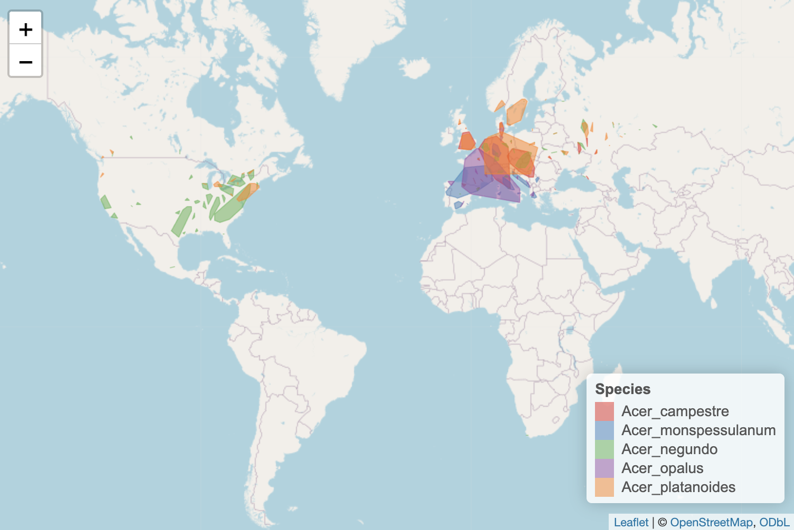

```{r, include = FALSE}
knitr::opts_chunk$set(
  collapse = TRUE,
  comment = "#>"
)
```

## Vignete Info 
This vignette provides an introduction to the usage of GeoFunPhy. In this vignette, we will use four functional traits (SLA, seed mass, leaf mass, and canopy height) of various tree, shrub, and flower species representative of a potential plant community in the Southeastern U.S. to classify and visualize their respective ecological statuses. 

This vignette will feature how to caluclate species range sizes step-by-step as well as how to use the function calc_range_size() to perform calculations in one step.

```{r setup, warning=FALSE, message=FALSE}
library(GeoFunPhy)
```

```{r other setup, warning=FALSE, message=FALSE, echo=FALSE}
library(knitr)
library(DT)
library(rgl)
library(tibble)
options(rgl.useNULL = TRUE)
```

# Example

## Create Trait Dataframe
```{r Create Trait Dataframe, results='asis'}
trait_df <- build_trait_data_LEDA(columns_to_select = c("SLA", "seed_mass", "leaf_mass", "canopy_height"), genera = c("Acer_", "Pinus_", "Fraxinus_", "Quercus_", "Tsuga_", "Solidago_", "Ulmus", "Populus", "Rhododendron_", "Betula_"))

trait_df <- rownames_to_column(trait_df, var = "species_name")
DT::datatable(trait_df)
```


## Input Phylogeny
Users can input their own phylogeny or use one of the four phylogeneies listed in Smith & Brown 2018 including: 

* ALLMB: GenBank and Open Tree of Life taxa with a backbone provided by Magallón et al. 2015
* ALLOTB: GenBank and Open Tree of Life taxa with a backbone provided by Open Tree of Life version 9.1
* GBMB: GenBank taxa with a backbone provided by Magallón et al. 2015
* GBOTB: GenBank taxa with a backbone provided by Open Tree of Life version 9.1"

```{r Input Phylogeny}
GBMB_phylogeny <- get_phy_angio("GBMB")
```

## Calculate Range Size *one step
```{r Calculate Range Sizes, results=FALSE, echo=TRUE, message=FALSE}
species_range_size <- calc_range_size(data_frame = trait_df, min_points = 4, gbif_limit = 2000, num_cores = 1)
```

```{r Display Range Size Table, echo=FALSE}
DT::datatable(species_range_size)
```

## Calculate Range Size *step-by-step

### Generate range convex hulls
```{r Generate Range Convex Hulls, results=FALSE, echo=TRUE, message=FALSE}
convex_hulls <- get_range_convex_hulls(data_frame = trait_df, min_points = 4, gbif_limit = 2250, num_cores = 1)
```


### Read in a continent GeoJSON 
```{r Get Continent SF, results=FALSE, echo=TRUE, message=FALSE}
continent_bounds <- get_continent_sf()
```

### Clip range convex hulls to continent continent_bounds
```{r Clip Convex Hulls, results=FALSE, echo=TRUE, message=FALSE}
clipped_hulls <- clip_polygons_to_land(convex_hulls = convex_hulls, continent_sf = continent_bounds)
```


### Calculate the range sizes of these clipped convex hulls
```{r Calculate Range Sizes of Clipped Convex Hulls, results=FALSE, echo=TRUE, message=FALSE}
range_sizes_step <- range_sizes(clipped_hulls)
```


```{r Display Range Size Table Step, echo=FALSE}
DT::datatable(range_sizes_step)
```

## Find which continents contain each species' convex hulls
```{r Find Continents, results=FALSE, echo=TRUE, message=FALSE}
continents <- check_continents(clipped_hulls, continent_bounds)
```

```{r Display Continent Table , echo=FALSE}
DT::datatable(continents)
```

## Find which biomes contain each species' convex hulls
```{r Find Biomes, results=FALSE, echo=TRUE, message=FALSE}
biomes <- check_biomes(clipped_hulls)
```

```{r Display Biomes Table , echo=FALSE}
DT::datatable(biomes)
```


## Calculate Evolutionary Distinctiveness

```{r Calculate Evolutionary Distinctiveness, results='asis', message=FALSE, warning=FALSE}
evol_df <- avg_evol_dist(data_frame = trait_df, phy = GBMB_phylogeny, time_slices = c(10, 25, 50), num_cores = 6)
DT::datatable(evol_df)
```

## Calculate Functional Distinctiveness
In order to calculate functional distinctiveness, we need merge the range size and evolutionary distinctiveness dataframes and remove any species with NA values for any trait. 
```{r Remove NA, results='asis'}

merged_df <- merge(merge(trait_df, species_range_size, by = "species_name", all = TRUE), evol_df, by = "species_name", all = TRUE)

merged_df <- na.omit(merged_df)
```

```{r Calculate Functional Distinctiveness, results='asis'}
fun_evol_range_df <- fun_dist(data_frame = merged_df, trait_columns = c("SLA", "seed_mass", "leaf_mass", "canopy_height"))
DT::datatable(fun_evol_range_df)
```

## Z Transform Dataframe 

```{r Z Transform Dataframe, results='asis'}
z_score_df <- scale_by_median(data_frame = fun_evol_range_df, columns_chosen = c("range_size", "mean_evol_dist"))
DT::datatable(z_score_df)
```

## Create Elbow Plots to Detmine Optimal K Means
### The optimal K means value can be determined by finding the "elbow" or bend in the plot. 

### Range Size Eblow: K = 2
``` {r Elbow Plot Range Size}
elbow_plot(data = z_score_df, variable = "range_size", k_max = 5)
```

### Evolutionary Distinctiveness Eblow: K = 2
``` {r Elbow Plot Evolutionary Distinctiveness}
elbow_plot(data = z_score_df, variable = "mean_evol_dist", k_max = 5)
```

### Functional Distinctiveness Eblow: K = 2
``` {r Elbow Plot Functional Distinctiveness}
elbow_plot(data = z_score_df, variable = "fun_dist", k_max = 5)
```

## Determine Eco-evolutionary Rarity Status

```{r Check EER Status, results=FALSE, echo=TRUE, message=FALSE}
EER_stat_df <- check_EER_status_k(data_frame = z_score_df, range_size_col = "range_size", mean_evol_dist_col = "mean_evol_dist", fun_dist_col = "fun_dist", range_size_k = 3, mean_evol_dist_k = 2, fun_dist_k = 2)
```

```{r Display EER Status Table, echo=FALSE}
DT::datatable(EER_stat_df)
```

## Visualizing Eco-evolutionary Status 

We can map the ecological statuses of species from the large dataframe onto interactive 3D space. This object can be manipulated and positioned by the user in order to best visualize the respective ecological statuses. 

<style>
  /* Adjust the dimensions as needed */
  .rgl-container {
    width: 600px; /* Change to your preferred width */
    height: 400px; /* Change to your preferred height */
  }
</style>

```{r Create 3d Visualization, out.width="100%", fig.dim = c(6, 6)}
figure <- plot_EER_status(data_frame = EER_stat_df, fun_dist = "fun_dist", range_size = "range_size", evol_dist = "mean_evol_dist")
rglwidget()
```


### If a still-image is desired rgl::rgl.snapshot() is recommended.

## Extra
### GeoFunPhy also offers plotting functionality of raw (unclipped) range polygons 

```{r Plot Convex Hulls, results=FALSE, echo=TRUE, message=FALSE}
trait_df_subset <- trait_df[1:5, ]
acer_maps <- range_poly_map(data_frame = trait_df_subset, clip = TRUE, continent_sf = continent_bounds)
```

```{r Map Output, out.width='800px', out.height='600px'}

```